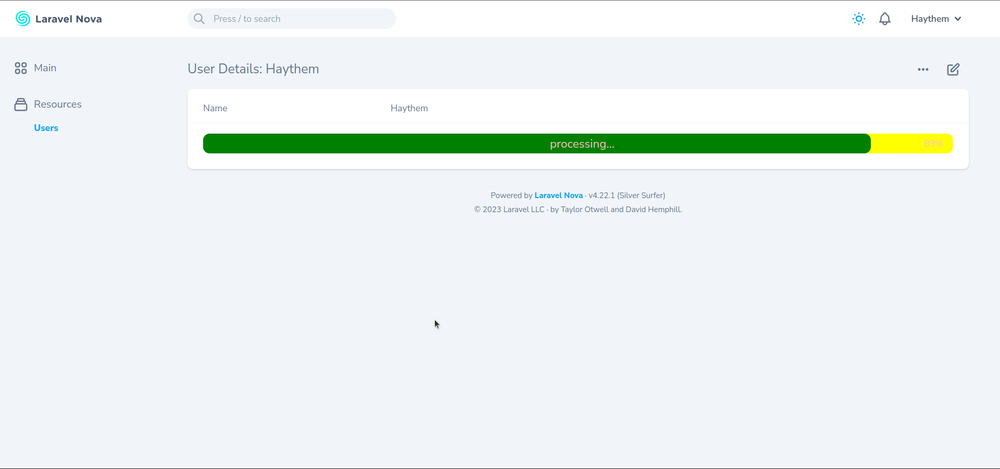
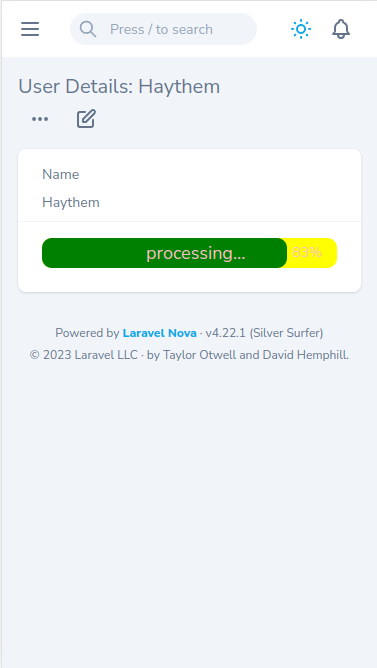

# ProgressBar

[](https://packagist.org/packages/haythem/)
[](https://packagist.org/packages/haythem/progress-bar)


Package Description: A dynamic progress bar field for laravel nova




## Installation

Install via composer

```bash
composer require haythem/progress-bar
```

## Setup route

```
Route::get('/progressbar', function () {
    return ["percentage" => rand(0, 100), "show" => true];
});
```

## Usage

```php
    use Haythem\ProgressBar\ProgressBar;

    public function fields(Request $request)
    {
     return [
            ProgressBar::make('Progress Bar')
                ->endPoint('/api/progress')
                ->callEvery(500)
                ->markAsDone(false)
                ->barColor("#FFC0CB")
                ->barBackgroundColor("yellow")
                ->textColor('pink')
                ->initLabel("please wait")
                ->processingLabel("processing")
                ->doneLabel("all is good")
                ->redirectWhenItsDone("https://www.google.com",true)  //second parameter is optional to open the url in new tab or in the same tab
                ->reloadWhenItsDone()
                ->animation(),//show three dots animation when initializing and processing
    ];
    }
```
